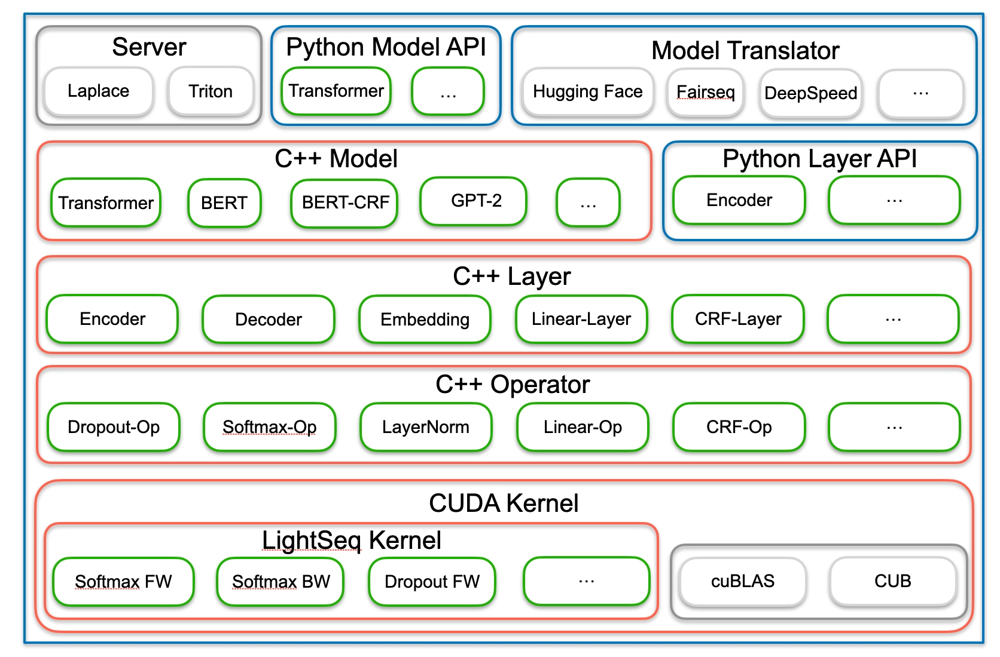

# README - 中文

`csrc` 目录中是新版本`lightseq`相关的代码，相较于旧版本`lightseq`的改进点在于: 新版本`lightseq`中实现了一套计算图逻辑，我们依据这套计算图逻辑做到了自动的显存复用管理，大大降低了开发过程中对于`kernel`的显存复用的开发成本，并使显存复用做到模型全局共享。我们实现了将训练和推理共享同一套代码逻辑，在后续的模型开发中，能够自然的确保训练和推理的效果一致。

---
## 设计架构


如架构图所示，`lightseq` 在逻辑结构上分为了 `Kernel`、`Operator`、`Layer`、`Model` 四个不同的粒度层级。

其中，`Kernel` 层定义了在设备上的具体运算逻辑，目前主要基于 `nvidia-cuda` 工具库实现的，我们可以将这一层的具体计算函数替换成其它平台的高性能运算库，以便捷的实现跨端迁移。

`Operator` 层是根据实际的运算粒度进行设计的，包含了诸如`Dropout`/`Softmax`/`LayerNorm`等多种运算算子。

`Layer` 层使基于 `Operator` 层进行构建的，`Layer` 层实现了部分类Transformer模型常用的结构，如 `MultiheadAttentionLayer`/`FeedForwardLayer`/`EncoderLayer`...

`Model` 层是对模型的完整封装，当使用 `Model` 层的接口时，我们期望它只被用于推理场景，因此并没有提供 `Model` 的直接训练。基于 `Model` 层，我们实现了对接 [nvidia-triton-server](https://github.com/triton-inference-server/server) 的完整方案，在测试中取得了不错的性能表现。用户可以通过这套方案便捷的实现整个server的部署。

---
## 实现方案


在具体的实现过程中，我们在 `csrc/lsflow` 中实现了5个类: `MemoryManager`/`Context`/`Tensor`/`Node`/`Layer`。

`MemoryManager` 类管理了整个模型的共享显存，本层提供接口给上层类注册张量的生命周期，并进行张量显存空间的实际分配。

`Context` 类管理了整个模型的上下文信息，包括 `cublas handler` / `cuda stream` / `MemoryManager` 在内的多种信息，`Context` 实例是跟模型实例一一对应的，显存的共享是在 `Context` 实例内部进行分配的。

`Tensor` 类是对张量的封装，所持有的显存分为两种类型: `FixedMemory` / `SharedMemory`。`FixedMemory` 是将已开辟好的空间地址分配给 `Tensor` 对象，`SharedMemory` 则是使用 `MemoryManager` 所开辟并分配的共享显存。

`Node` 类是计算图中节点的抽象，大体上分为了两类: `Operator` 和 `Variable`。\
`Operator` 类是对运算步骤的一层封装，包含了 `forward & backward` 函数。\
`Variable` 类是对运算的输入/输出的封装，其中记录了 `value` 和 `grad`，用于表示 `Operator` 之间的输入输出张量。 \
`Operator` 和 `Variable` 所构建的计算图描述了运算步骤的上下游关系。

`Layer` 类是当前对外调用接口的最小单元，其内部是由 `Node` 所构建的计算子图。`Layer` 层可以对接`pybind_layer`, 用做基于python的训练和推理; 也可以对接 `Model` 层。

----
## 开发须知

### Kernel层
`Kernel` 层根据所需要运行的设备，对应实现高性能的计算逻辑即可，无过多的开发需求。

### Operator层
> 以 DropoutOp 为例

**初始化部分**

初始化阶段需要先调用 Operator 基类的初始化函数: Operator(op_name)。
``` C++
DropoutOp(float r, size_t max_ele_num)
    : Operator("Dropout"), ratio(r), _max_ele_num(max_ele_num) {
_mask.reset(new Tensor("mask", max_ele_num * sizeof(uint8_t)));
}
```

**计算图构造部分**

通过重载 `operator()` 函数实现计算图上下游关系的实际构建，该函数主要处理两部分逻辑: 
1. 创建出 children 节点的实例；
2. 设置 `Operator` 类的 `parents` 和 `children` 对象。
``` C++
template <typename T1, typename T2>
Variable* DropoutOp<T1, T2>::operator()(Variable* inp) {
  Variable* result = new Variable("DropoutOp_out", _max_ele_num * sizeof(T1),
                                  _max_ele_num * sizeof(T2));
  this->set_parents({inp});
  this->set_children({result});
  return result;
}
```

**前向传播/反向传播函数**

在 `forward/backward` 中，通过 `value() / grad()` 函数获取到张量的实际显存地址，当张量使用的是共享显存并且尚未分配实际地址时，此函数会向`MemoryManager`中更新张量的生命周期。

注意这里的 `(uint8_t*)_mask->tensor()`，通过直接调用 `tensor()` 函数获取到了张量的地址，此部分的显存仍然是使用的模型共享显存。
``` C++ 
template <typename T1, typename T2>
void DropoutOp<T1, T2>::forward() {
  cudaStream_t stream = _context_ptr->get_stream();

  T1* input = (T1*)parent(0)->value();
  T1* output = (T1*)child(0)->value();
  uint8_t* mask_ptr = (uint8_t*)_mask->tensor();

  launch_ls_dropout<T1>(output, input, mask_ptr, _count, RATIO(), stream,
                        false);
}

template <typename T1, typename T2>
void DropoutOp<T1, T2>::backward() {
  cudaStream_t stream = _context_ptr->get_stream();

  T2* input_grad = (T2*)parent(0)->grad();
  T2* output_grad = (T2*)child(0)->grad();
  uint8_t* mask_ptr = (uint8_t*)_mask->tensor();

  launch_ls_dropout<T2>(input_grad, output_grad, mask_ptr, _count, RATIO(),
                        stream, true);
}
```

### Layer层
> 以 FeedForwardLayer 为例

**初始化部分**

初始化阶段的执行顺序如下
1. 先调用基类的初始化函数 `Layer("FeedForwardLayer")`;
2. 对该 `Layer` 对象中所直接包含的 `Layer` 和 `Operator` 对象进行初始化;
3. 对该 `Layer` 对象中所直接包含的 `Variable` 节点进行初始化;
4. 执行 `_context_ptr->exit_layer()`，`Context` 会在 `Layer` 基类构造函数中记录栈信息，因此需要在完成 `Layer` 对象的构造后执行出栈处理。

**计算图构造部分**

Layer层参与构造计算图的部分逻辑顺序如下:
1. 执行 `LAYER_PRE_INPUTS(...)`，设置 `Layer` 对象的 `parents` 成员，此函数内部会将 `Layer` 对象压入 `Context` 实例所维护的栈中;
2. 设置 `Operator` 间的上下游关系，指明计算图的逻辑顺序;
3. 执行 `LAYER_POST_OUTPUTS(...)`，设置 `Layer` 对象的 `children` 成员，此函数会对 `Context` 实例所维护的栈进行出栈处理。

**前馈/反馈函数**

通常情况下，`Layer` 类所派生的子类中不需要实现 `forward`/`backward` 函数，基类中会自动的基于计算图执行深度优先遍历进行计算。但是部分情况下，如 `Decoder` 在推理情况下由于 `step=0` 与 `step>0` 时的执行逻辑会存在区别，因此在这类情况下需要自行重载 `forward`/`backward` 函数。
